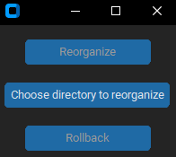

# <b>Directory Files Reorganize</b>

## <b>Objective</b> 

The software objective is to reoorganize images, documents, executables, compressed files and of media in a directory,
separing them in speciefic folders for each file type.

I believe the logic of that project is simple, I was want to practice my Python develop skills, DRY and do a 
clean code, I tried to make a simple code for every one who to have a basic knowledge at developing can do read, 
understand my code and contribute if see any thing can be improved.

## <b>Funcionalities</b>

First, you can execute the software in project directory on executable file named: <b>"directory_files_reorganizer.exe"</b>

The below image is software main window, opened after execute:

### Buttons
<li><b>Choose a directory to reorganize:</b> This button do a open folder event, where you can choose the directory to 
reorganize;</li>

<i>Function: chooseDirectoryToReorganize()</i>

<li><b>Reorganize:</b> After choose a folder, this button be available to interact, onclick reorganize every file 
in directory to specific folder of him type;</li>

<i>Function: reorganizeFiles()</i>

<li><b>Rollback:</b> After reorganize successful, this button be available to interact, onclick rollback
the movings that have been does, putting the files back in original directory;</li>

<i>Function: rollbackMoves()</i>
